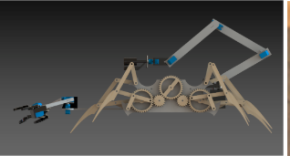

ScorpionBot is a mechatronic device capable of identifying, manipulating, and transporting functional tesseracts(magnetic cubes).  
The device uses two front limbs equipped with mechanical grippers and Hall Effect sensors to locate and collect functional tesseracts. 
A longer appendage consisting of multiple segments connected by servos attaches to the rear of the device is used to transfer tesseracts 
from the claws to the holding area in mode one; and to transfer tesseracts from the holding area to the 43 cm high delivery platform in 
mode two. Two line trackers are used to aid in identifying slots in the holding area, as well as a safety check to ensure the device 
does not exit its segment of the factory. Locomotion is achieved through a Klann linkage octopod mechanism which provides stability and 
versatility. Three ultrasonics, located on the front and and each side, allow the device to navigate the factory floor, and avoid 
collisions with unexpected objects.  
